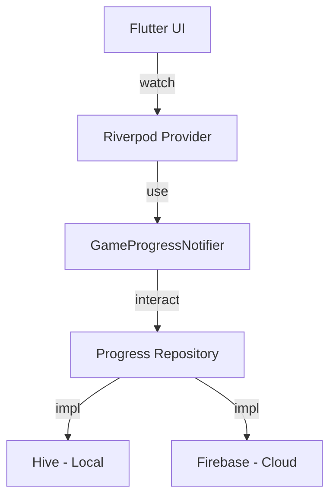

# Parable Bloom - Architecture & State Management

This document explains the current state management and persistence implementation using Riverpod and Hive, and outlines the strategy for integrating Firebase in the future.

## 🏗️ Current Architecture

### 1. State Management (Riverpod)

We use **Riverpod** for reactive state management. This decouples the game logic from the UI and allows for easy testing and debugging.

- **`gameProgressProvider`**: The central source of truth for the user's progress (current level, completed levels).
- **`vineStatesProvider`**: Manages the dynamic "blocking" logic for all arrows in the current level. It uses the `LevelSolver` to calculate which arrows are movable.
- **`gameInstanceProvider`**: Holds the reference to the active `GardenGame` instance, allowing UI components and providers to interact with the game engine.
- **Transient State Providers**: Small providers for lives, level completion, and game-over states.

### 2. Local Persistence (Hive)

We use **Hive** for fast, local-first key-value storage.

- **Initialization**: Hive is initialized in `main.dart` and the `Box` is injected into the Riverpod `ProviderScope`.
- **Sync Logic**: The `GameProgressNotifier` handles the synchronization between the in-memory state and the Hive storage.

---

## 🔍 Validation & Technical Assessment

| Feature | Current Status | Assessment |
|---------|----------------|------------|
| **Decoupling** | High | UI components are fully isolated from the persistence layer. |
| **Logic Integrity** | Solid | The `LevelSolver` (BFS) ensures all levels are solvable and blocking is accurate. |
| **Persistence Coupling** | Moderate | `GameProgressNotifier` currently calls Hive directly. This is fine for MVP but needs abstraction for Firebase. |
| **Performance** | Excellent | Hive's synchronous reads/writes are perfect for game state without blocking the UI thread. |

---

## ☁️ Path to Firebase Integration

The current setup is "Firebase Ready" because of the use of Riverpod. To add Firebase, we will implement the **Repository Pattern**.

### Proposed Refactor for Firebase

1. **Define an Abstract Repository**:

```dart
abstract class ProgressRepository {
  Future<GameProgress> loadProgress();
  Future<void> saveProgress(GameProgress progress);
}
```

1. **Implement Hive & Firebase Repositories**:

- `HiveProgressRepository` (Local-first)
- `FirebaseProgressRepository` (Cloud sync)

1. **Update Provider**:
The `gameProgressProvider` will then depend on the `progressRepositoryProvider` instead of the Hive `Box` directly.



### Benefits of this Approach

- **Offline First**: Users can play without internet (Hive), and progress syncs to Firebase once online.
- **Lazy Cloud Integration**: We can launch with Hive and add the Firebase implementation later without changing a single line of UI code.
- **Cross-Platform Sync**: Users can pick up where they left off on different devices.
