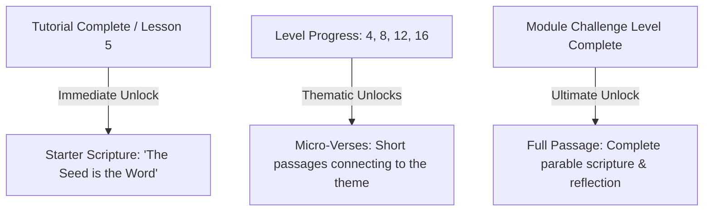

# Scripture Library & Reward System

This document provides a comprehensive technical overview of the **Scripture Library and Reward System** in Parable Bloom. This system is designed to provide players with frequent, spiritually engaging touchpoints and structured scripture meditation opportunities throughout their gameplay.

---

## 1. Scripture Progression Model

To prevent excessive delays in scripture delivery, the progression model offers three distinct tiers of scripture rewards:



### 1.1 Starter Scripture

* **Trigger**: Immediately upon completing the tutorial (Lesson 5).
* **Purpose**: Instantly rewards the player and establishes scripture collection early in the user lifecycle.
* **First Scripture**: `Luke 8:11` ("The seed is the word of God").

### 1.2 Micro-Verses

* **Trigger**: Unlocked at periodic checkpoints within a module (e.g., after level 4, level 8, level 12, and level 16 of the Seedling module).
* **Purpose**: Displays shorter, highly focused thematic verses that build anticipation for the final full parable.
* **Selection**: Set per-module under the `scriptures` list in `modules.json`.

### 1.3 Full Passage

* **Trigger**: Unlocked upon completing a module's Challenge Level.
* **Purpose**: Delivers the complete parable passage, reflection, and journaling options.

### 1.4 Backfill Migration for Existing Users

To support existing users who completed levels before the scripture progression updates, a migration mechanism is integrated directly into the app startup sequence:

* **Trigger**: Automatically runs when the app initializes game progress (inside `GameProgressNotifier.initialize()`), or completes a manual cloud sync/conflict resolution.
* **Logic**:
  * Scans the user's completed levels to locate the highest completed level index in the playlist.
  * Identifies any scriptures whose trigger level falls on or before that highest completed level.
  * If any eligible scriptures are not present in `unlockedScriptureIds`, they are automatically backfilled and assigned a random translation.
* **Idempotence**: The process is a no-op if all eligible scriptures are already unlocked, preserving existing journal translation choices and preventing duplicate entries.

---

## 2. Core Architecture & Services

The scripture feature relies on a decoupled, offline-first service architecture managed by Riverpod.

### 2.1 Scripture Service (`ScriptureService`)

Located at [`lib/services/scripture_service.dart`](file:///Users/engarcia/Development/parable-bloom/apps/parable-bloom/lib/services/scripture_service.dart), this service manages all scripture loading, randomization, and fallbacks:

* **Translation Randomization**: When unlocking a scripture, it randomly selects an active translation ID from the active translations pool.
* **Offline KJV Fallback**:
  * For online-only translations (e.g. ESV, CSB, NET), it attempts to fetch the text from the API.
  * If the API fetch fails, or the device is offline, it automatically retrieves the corresponding KJV text from the local database.
* **Clean Formatting**: Sanitizes verse texts, strips redundant XML/HTML tags or footnotes, and ensures standardized styling.

### 2.2 Riverpod Providers

* **`scriptureServiceProvider`**: Provides access to the `ScriptureService` instance.
* **`unlockedScripturesProvider`**: A future provider listing all scriptures currently unlocked by the player, derived from the saved `GameProgress`.

---

## 3. Data Schemas

### 3.1 Translation Metadata (`scripture_metadata.json`)

Located at [`assets/data/scripture_metadata.json`](file:///Users/engarcia/Development/parable-bloom/apps/parable-bloom/assets/data/scripture_metadata.json), this registry lists all supported translations, their licenses, active statuses, and required attributions.

Example Schema:

```json
{
  "translations": [
    {
      "id": "kjv",
      "name": "King James Version",
      "abbreviation": "KJV",
      "active": true,
      "requires_commercial_license": false,
      "attribution": "Public Domain.",
      "url": ""
    },
    {
      "id": "esv",
      "name": "English Standard Version",
      "abbreviation": "ESV",
      "active": true,
      "requires_commercial_license": true,
      "attribution": "Scripture quotations are from The ESV® Bible (The Holy Bible, English Standard Version®), copyright © 2001 by Crossway, a publishing ministry of Good News Publishers. Used by permission. All rights reserved.",
      "url": "https://www.crossway.org"
    }
  ]
}
```

### 3.2 Scripture Backups Database (`scripture_library.json`)

Located at [`assets/data/scripture_library.json`](file:///Users/engarcia/Development/parable-bloom/assets/data/scripture_library.json), this database stores the offline KJV texts for all parables and micro-verses.

Example Schema:

```json
{
  "scriptures": {
    "Luke 8:11": {
      "reference": "Luke 8:11",
      "text": "Now the parable is this: The seed is the word of God."
    },
    "Matthew 13:1-23": {
      "reference": "Matthew 13:1-23",
      "text": "The same day went Jesus out of the house, and sat by the sea side..."
    }
  }
}
```

### 3.3 Module Registry Integration (`modules.json`)

Located at [`assets/data/modules.json`](file:///Users/engarcia/Development/parable-bloom/assets/data/modules.json), this registry maps scripture triggers to levels/lessons.

Example:

```json
{
  "modules": [
    {
      "id": 1,
      "name": "Seedling",
      "theme_seed": "forest",
      "levels": [
        "lvl_seed_01",
        "lvl_seed_02"
      ],
      "challenge_level": "lvl_seed_challenge",
      "scriptures": [
        {
          "id": "seed_starter",
          "trigger_level": "lesson_5",
          "reference": "Luke 8:11",
          "title": "The Seed is the Word",
          "type": "starter"
        },
        {
          "id": "seed_micro_1",
          "trigger_level": "lvl_seed_04",
          "reference": "Mark 4:14",
          "title": "Sowing the Word",
          "type": "micro"
        }
      ]
    }
  ]
}
```

---

## 4. UI & Flow Integrations

### 4.1 Unlock Banners & Overlays

* When a level or lesson matching a trigger level is completed, the game shows a beautiful celebration banner:
  * Plays sound effects and animates a scripture unlock card.
  * Shows the selected translation name and its required publisher attribution at the bottom of the card.

### 4.2 Journal Persistence

* To maintain consistency, the randomized translation selected at the time of unlock is locked into the user's progress.
* When opening the **Journal Screen**, the app loads the exact translation that was locked to that entry. If the user is offline and that translation was an online translation, the UI falls back seamlessly to KJV.
