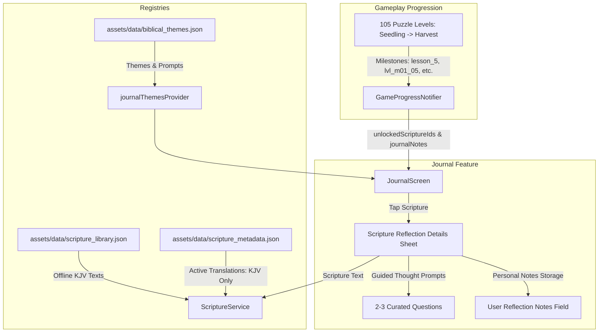
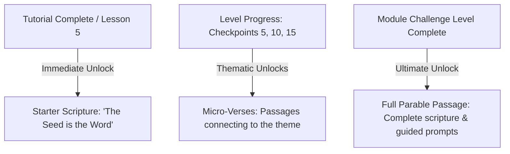

# Scripture Library, Biblical Themes & Journal System

This document provides a comprehensive technical overview of the **Scripture Library, Biblical Themes, and Journal System** in Parable Bloom. This system is designed to provide players with frequent, spiritually engaging touchpoints, rich thematic categorization, guided devotional reflection prompts, and personal journaling capabilities throughout their gameplay.

---

## 1. Core Concepts & Decoupling

The journal and scripture rewards architecture is decoupled into two complementary layers:

1. **Gameplay Level Progression Layer**: 105 gameplay levels progressing through flower growth stages (`Seedling` $\rightarrow$ `Sprout` $\rightarrow$ `Blossom` $\rightarrow$ `Flourish` $\rightarrow$ `Harvest`).
2. **Biblical Themes & Journal Layer**: Spiritual meditation modules organized by biblical concepts (`Spiritual Growth`, `Faith & Trust`, `Patience & Unseen Works`, `Abiding Love`, `Joy & The Harvest`), each containing curated scripture passages, multi-question guided reflection prompts, and personal reflection note taking.



---

## 2. Scripture Progression Model & Reward Tiers

To prevent excessive delays in scripture delivery, the progression model offers three distinct tiers of scripture rewards unlocked across gameplay milestones:



### 2.1 Starter Scripture

- **Trigger**: Immediately upon completing the tutorial (Lesson 5).
- **Purpose**: Instantly rewards the player and establishes scripture collection early in the user lifecycle.
- **First Scripture**: `Luke 8:11` ("The seed is the word of God").

### 2.2 Micro-Verses

- **Trigger**: Unlocked at periodic checkpoints within gameplay progression (e.g. Level 5, Level 15, Level 26, Level 31, etc.).
- **Purpose**: Displays shorter, highly focused thematic verses that build anticipation for the final full parable.
- **Selection**: Curated under each theme in `biblical_themes.json`.

### 2.3 Full Parables

- **Trigger**: Unlocked upon completing a module's Challenge Level (e.g. `lvl_m01_challenge`, `lvl_m02_challenge`, `lvl_m03_challenge`, `lvl_m04_challenge`, `lvl_m05_challenge`).
- **Purpose**: Delivers the complete parable passage, rich guided reflection questions, and personal journaling options.

### 2.4 Backfill Migration & Progress Repair for Existing Users

To support existing users who completed levels in prior versions (including legacy integer-based saves and accounts with progression sequence gaps), an automated repair and backfill mechanism runs during app startup:

- **Trigger**: Automatically runs when the app initializes game progress (inside [`GameProgressNotifier.initialize()`](file:///Users/engarcia/Development/parable-bloom/apps/parable-bloom/lib/features/game/application/providers/progress_providers.dart)), or completes a cloud sync / conflict resolution.
- **Legacy Level ID Mapping**:
  - Legacy integer saves (levels 1–105) are accurately mapped in [`GameProgress.fromJson`](file:///Users/engarcia/Development/parable-bloom/apps/parable-bloom/lib/features/game/domain/entities/game_progress.dart) to their module logical IDs:
    - 1–20 $\rightarrow$ `lvl_m01_01`..`lvl_m01_20`, 21 $\rightarrow$ `lvl_m01_challenge`
    - 22–41 $\rightarrow$ `lvl_m02_01`..`lvl_m02_20`, 42 $\rightarrow$ `lvl_m02_challenge`
    - 43–62 $\rightarrow$ `lvl_m03_01`..`lvl_m03_20`, 63 $\rightarrow$ `lvl_m03_challenge`
    - 64–83 $\rightarrow$ `lvl_m04_01`..`lvl_m04_20`, 84 $\rightarrow$ `lvl_m04_challenge`
    - 85–104 $\rightarrow$ `lvl_m05_01`..`lvl_m05_20`, 105 $\rightarrow$ `lvl_m05_challenge`
- **Progress Gap Healing**:
  - Identifies the user's highest completed level index or current level index in the playlist (`effectiveMaxIndex`).
  - Backfills any missing level IDs from index `0` up to `effectiveMaxIndex` in `completedLevels`, ensuring complete module fulfillment.
- **Biblical Themes & Scripture Backfill**:
  - Unlocks any eligible micro-verses or starter scriptures in `unlockedScriptureIds` whose trigger levels fall on or before `effectiveMaxIndex`.
  - Checks completed modules (`progress.isModuleCompleted()`) and automatically populates missing parable translations in `unlockedTranslations`.
- **Idempotence**: Preserves user-customized translations, avoid duplicate entries, and acts as a safe no-op once data is aligned.

---

## 3. Biblical Themes & Reflection Structure

### 3.1 Supported Biblical Themes

| Theme ID   | Theme Name                  | Icon              | Focus / Description                                                                                 |
| :--------- | :-------------------------- | :---------------- | :-------------------------------------------------------------------------------------------------- |
| `growth`   | **Spiritual Growth**        | `spa`             | Cultivating good soil in our hearts, allowing God's Word to take deep root and bear lasting fruit.  |
| `faith`    | **Faith & Trust**           | `psychology`      | Trusting God from small beginnings, knowing that genuine faith in a great God moves mountains.      |
| `patience` | **Patience & Unseen Works** | `hourglass_empty` | Waiting on the Lord with quiet confidence, trusting in His unseen workings and perfect timing.      |
| `love`     | **Abiding Love**            | `favorite`        | Remaining connected to Christ the true Vine, welcoming His pruning to bear abundant, lasting fruit. |
| `joy`      | **Joy & The Harvest**       | `wb_sunny`        | Persevering with joyful hope and laboring in the abundant harvest of God's kingdom.                 |

### 3.2 Guided Reflection Prompts

Every passage includes 2–3 curated thought-provoking questions designed to encourage contemplation. Examples:

- _"What kind of soil (receptive, distracted, or hardened) describes your heart right now?"_
- _"Where in your life are you striving in self-reliance instead of trusting God to give the increase?"_
- _"What painful pruning has God used in the past to yield peaceable righteousness?"_

### 3.3 Personal Reflection Notes

Users can record personal reflections, prayers, or applications directly under any scripture:

- Stored in `GameProgress.journalNotes` (`Map<String, String>` mapping `passageId` $\rightarrow$ user text).
- Offline-first storage in local Hive database and synchronized to Cloud Firestore when signed in.

---

## 4. Translation Policy & Initial Launch

> [!IMPORTANT]
> **Initial Launch Policy: Strictly KJV**
> For the initial launch release, all scriptures strictly use the **King James Version (KJV)** (Public Domain).
> Other translations (`WEB`, `NET`, `ESV`, `CSB`, `NLT`, `NIV`) are maintained in the metadata schema in `pending` status and will be enabled in subsequent updates once formal publisher licensing/attributions are finalized.

### 4.1 Translation Metadata Schema (`scripture_metadata.json`)

```json
{
  "translations": [
    {
      "id": "kjv",
      "name": "King James Version",
      "abbreviation": "KJV",
      "publisher": "Public Domain",
      "licenseType": "public_domain",
      "copyrightNotice": "Scripture quotations are from the King James Version (KJV) Bible. Public domain.",
      "status": "active"
    }
  ]
}
```

### 4.2 Local Scripture Database (`scripture_library.json`)

Contains full offline KJV text representations for every reference in the game.
