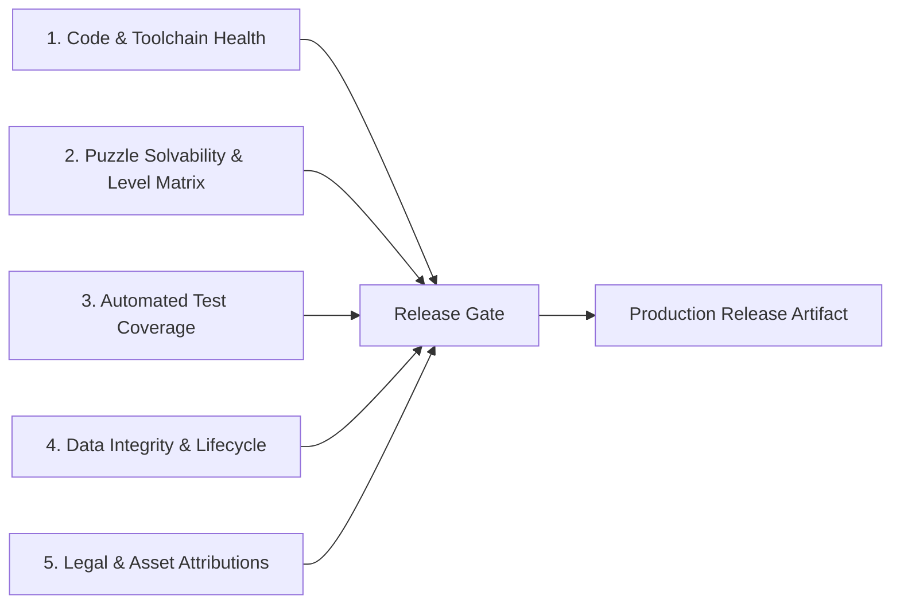

# 🚀 Reference: Launch Readiness Verification & Audit Specification

This document serves as the formal technical reference specification for evaluating and verifying release readiness across **Parable Bloom** applications, services, and tooling.

---

## 🎯 Verification Framework Overview

Release candidates must satisfy verification criteria across five core technical pillars prior to store submission or production deployment:

---

## 📋 Release Verification Gates

### 1. Code & Toolchain Health

- [x] **Monorepo Validation**: `task validate` executes cleanly across all projects (Flutter app, Next.js site, Go level-builder) with zero failures.
- [x] **Static Analysis**: `task flutter:analyze` returns **zero warnings and zero errors** across all production and test files.
- [x] **Go Toolchain Alignment**: Inherits Go `1.26.6` workspace-wide; `task lb:lint`, `task lb:test`, and `task lb:build` pass cleanly.
- [x] **Dependencies Hygiene**: Production dependencies contain zero test-only packages; `mockito` and `test` isolated to `dev_dependencies`.

### 2. Puzzle Solvability & Level Matrix

- [x] **Level Solvability**: `task levels:validate-solvable` passes for all **105 puzzle levels** (5 modules × 21 levels) using the BFS deterministic solver.
- [x] **Lesson System**: All 5 progressive lessons (`lesson_1.json` to `lesson_5.json`) load and validate against structural rules.
- [x] **Occupancy & Connectivity**: 100% board cell occupancy with valid head-to-tail path continuity and zero unresolvable cycle deadlocks.

### 3. Automated Test Suite

- [x] **Unit & Integration Suite**: All Flutter unit and repository tests pass.
- [x] **Screen Widget Tests**: Widget tests in place for primary views:
  - `HomeScreen` (`test/features/home/presentation/screens/home_screen_test.dart`)
  - `SettingsScreen` (`test/features/settings/presentation/screens/settings_screen_test.dart`)
  - `JournalScreen` (`test/features/journal/presentation/screens/journal_screen_test.dart`)
  - `GameHeader` & `PauseMenuDialog` (`test/features/game/presentation/widgets/game_header_and_pause_dialog_test.dart`)

### 4. Data Integrity & App Lifecycle

- [x] **Account Deletion Flow**: In-app account deletion resets local storage and deletes Firestore cloud documents prior to Firebase Auth user deletion.
- [x] **Engine Teardown**: Flame `GardenGame` instance initialized in `initState()` and explicitly disposed in `dispose()`.
- [x] **Crash Fallback & Router Boundaries**: `GoRouter` configured with `errorBuilder` and `ErrorWidget.builder` registered for graceful error recovery.
- [x] **Branding & Social Metadata**: Web PWA `manifest.json` configured with brand green `#177245` and `#1A2E3F` background; Open Graph and Twitter tags populated.

### 5. Legal & Asset Attributions

- [x] **Licensing Attribution**: All audio assets, fonts (Fraunces, Playfair Display, Alegreya Sans), textures, and devotionals fully documented in `documentation/reference/attributions.md`.
- [x] **Scripture Compliance**: Scripture quotations comply with copyright and gratis usage guidelines documented in `documentation/reference/scripture-licensing.md`.

---

## 🛠️ Automated Verification Commands

| Step                   | Command                           | Expected Result                            |
| :--------------------- | :-------------------------------- | :----------------------------------------- |
| **Monorepo Health**    | `task validate`                   | Exit code 0, all Nx targets green          |
| **Level Solvability**  | `task levels:validate-solvable`   | Exit code 0, 105/105 levels solvable       |
| **Static Analysis**    | `task flutter:analyze`            | Exit code 0, "No issues found!"            |
| **Flutter Test Suite** | `task flutter:test`               | Exit code 0, all unit/widget tests passing |
| **Go Level Builder**   | `task lb:test`                    | Exit code 0, all Go package tests passing  |
| **Next.js Web Site**   | `nx run parable-bloom-site:build` | Exit code 0, static generation complete    |
